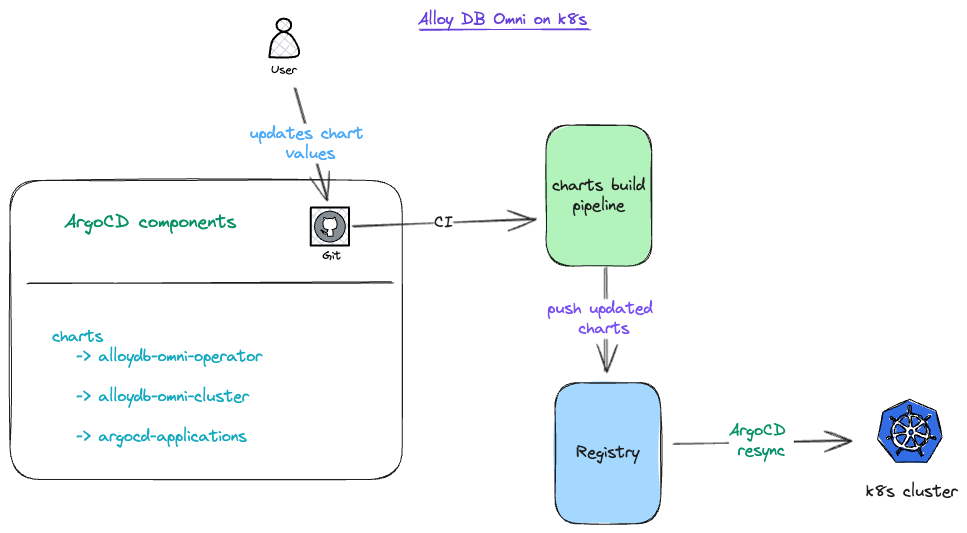

## AlloyDB Omni on Kubernetes

This repository contains Helm charts to deploy AlloyDB Omni on Kubernetes.

## Architecture



## Helm values

### alloydb-omni-cluster

| Name                              | Description                                                                               | Default   |
|:----------------------------------|:------------------------------------------------------------------------------------------|:----------|
| `admin_password`                  | Admin password for the DBCluster                                                          | `n/a`     |
| `database_version`                | Database version                                                                          | `15.5.2`  |
| `cpu_count`                       | CPU count for the cluster                                                                 | `2`       |
| `memory_size`                     | Memory size for the cluster                                                               | `16Gi`    |
| `data_disk_size`                  | Disk size for the cluster                                                                 | `100Gi`   |
| `cluster_name`                    | Name of the cluster                                                                       | `n/a`     |
| `cluster_namespace`               | Namespace to deploy the cluster                                                           | `default` |
| `num_standbys`                    | Number of standby instances                                                               | `1`       |
| `num_readpools`                   | Number of readpool instances                                                              | `1`       |
| `ext_lb`                          | Set `true` to enable external LB for the instance                                         | `false`   |
| `allow_ext_traffic`               | AllowExternalIncomingTrafficToInstance will be used to configure the external LB creation | `true`    |
| `pgadmin.enabled`                 | Set `true` to enable `pgadmin4`                                                           | `true`    |
| `parameters`                      | Add AlloyDB Omni parameters                                                               | `n/a`     |
| `enable_standby_as_read_replicas` | Set `true` to enable standby as read replicas                                             | `*`       |
| `walArchiveSetting`               | `location` and `archiveMode` wal archive settings                                         | `n/a`     |

`*` the default for `enable_standby_as_read_replicas` will be decided based on the following rules

1. `false` if `num_standbys == 0` and `enable_standby_as_read_replicas != true`
2. `true` if `enable_standby_as_read_replicas == true`

### argocd-applications

| Name                | Description                      | Default |
|:--------------------|:---------------------------------|:--------|
| `repo`              | Chart repository                 | `n/a`   |
| `operator_revision` | Operator Chart version           | `1.0.*` |
| `cluster_revision`  | Cluster Chart version            | `1.0.*` |
| `clusters`          | List of cluster `url` and `name` | `n/a`   |

## Sidecars

Add the sidecars to `alloydb-omni-cluster` chart [templates](charts/alloydb-omni-cluster/templates).

## Admin password rotation steps

1. Create a secret with the new password, the key needs to be the `DBCluster` instance name.
2. Set the secret name in `spec.primarySpec.adminUser.passwordRef`.
3. Wait for `status.conditions.AdminPasswordReady` condition to be `True` with observedGeneration equal to the generation of the DBCluster object.

## Deploy

1. Update `REPO` in `argocd-applications` chart [values.yaml](charts/argocd-applications/values.yaml).
2. You can use the provided `cloudbuild.yaml` to build and push the charts to a GAR repository.
    ```
    gcloud builds submit . --substitutions=_REPO=<REPOSITORY_NAME>,_LOCATION=<REPOSITORY_LOCATION>,_CHART_VERSION=1.0.0
    ```
3. You can deploy the following Helm chart to create applications in ArgoCD.
    ```
    helm upgrade -i alloydb-omni oci://${_LOCATION}-docker.pkg.dev/${PROJECT_ID}/${_REPO}/alloydb-omni-argocd-applications
    ```